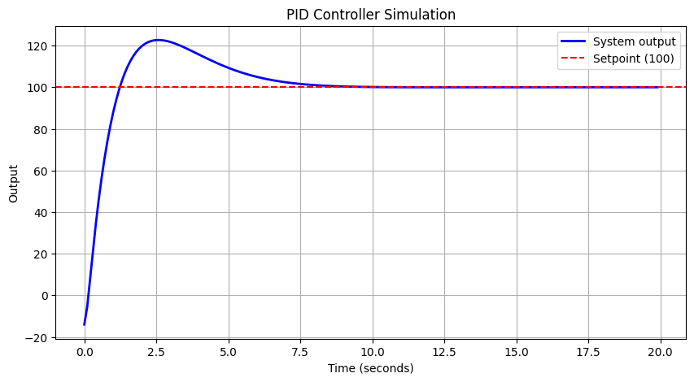
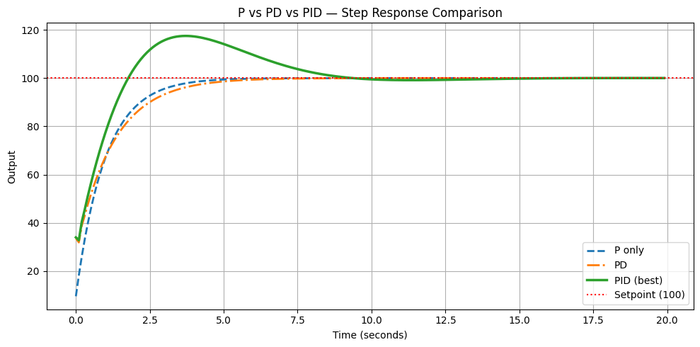

# PID Controller Simulation in Python

A simulation of a PID (Proportional-Integral-Derivative) 
controller applied to DC motor speed control, built from 
scratch in Python.

## What is PID?
PID is a feedback control algorithm used everywhere in 
robotics — motor control, drone stabilisation, autonomous 
vehicles, and industrial automation. It calculates a 
correction based on three terms:

- **P (Proportional):** Reacts to current error
- **I (Integral):** Eliminates steady-state error 
  using accumulated past error  
- **D (Derivative):** Prevents overshoot by reacting 
  to rate of change

## What this project demonstrates
- Full PID feedback loop simulated in Python from scratch
- Effect of each gain (Kp, Ki, Kd) on system response
- Comparison of P-only, PD, and full PID performance
- Instability from improper gain tuning (integral windup)

## Results

### Single PID Response

### P vs PD vs PID Comparison

## Key observations
- P only: fast response but permanent steady-state error
- PD: smoother response but still cannot reach target exactly
- PID: reaches and holds target precisely — only full 
  PID eliminates steady-state error completely

## How to run
pip install matplotlib numpy
python pid_simulation.py

## Concepts demonstrated
| Concept | Observed in simulation |
|---|---|
| Steady-state error | P only curve never reaches 100 |
| Integral windup | High Ki causes instability |
| Derivative kick | Initial dip at t=0 |
| Overdamped response | Low gains — slow but smooth |
| Underdamped response | High gains — fast but oscillates |
| Critically damped | Balanced gains — ideal response |
